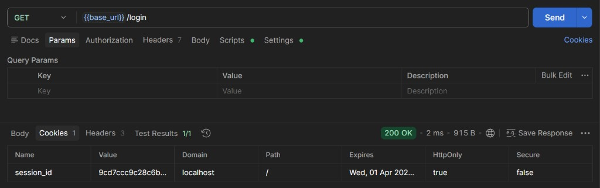
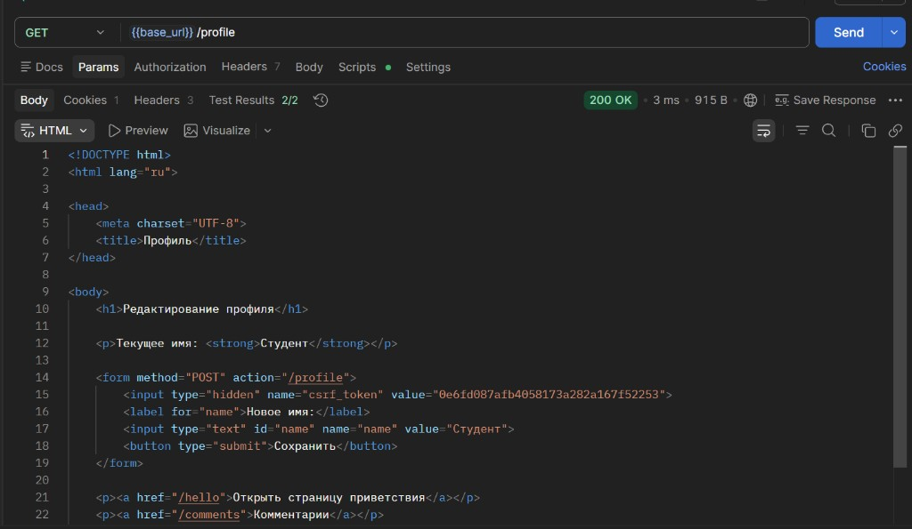
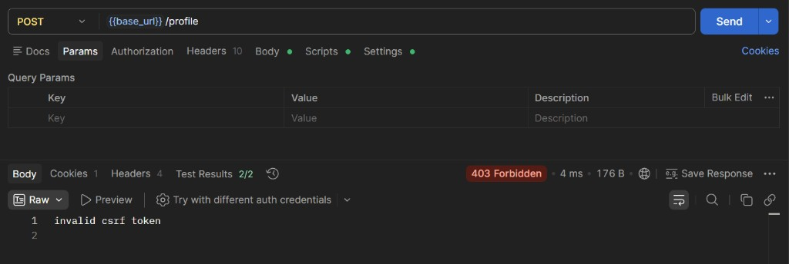
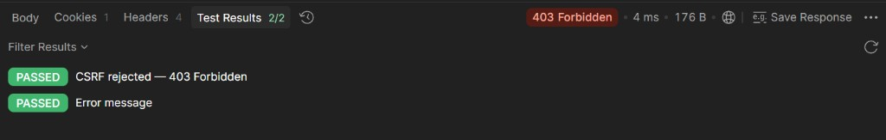
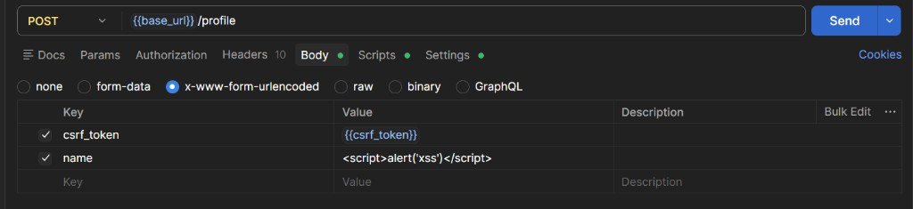
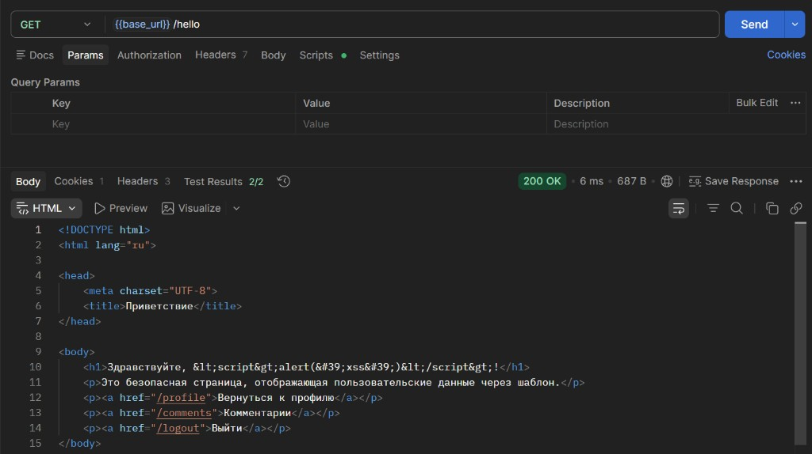
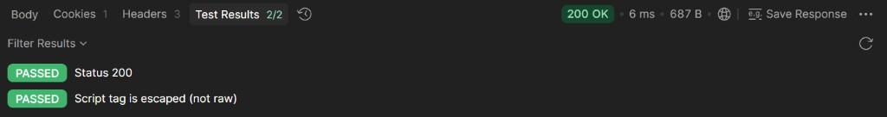

# Практическое задание 6
## Шишков А.Д. ЭФМО-02-22
## Тема
Защита форм от CSRF/XSS. Работа с secure cookies.

## Цель
Изучить принципы защиты web-приложений от CSRF- и XSS-атак, а также настроить безопасные cookies для аутентификации и хранения пользовательской сессии.

---

## 1. Структура проекта

Сервис websec добавлен в основной проект как `services/websec/`:

```
services/websec/
  cmd/server/main.go              — точка входа, флаг --https, регистрация маршрутов
  internal/auth/cookie.go         — установка/чтение/удаление session cookie (Secure-режим)
  internal/auth/csrf.go           — генерация криптографически безопасных токенов
  internal/httpapi/handler.go     — HTTP-обработчики (Login, Logout, Profile, Hello, Comments)
  internal/store/store.go         — in-memory хранилище сессий и комментариев (sync.RWMutex)
  templates/profile.html          — HTML-форма с CSRF-токеном
  templates/hello.html            — страница приветствия (вывод через шаблон)
  templates/comments.html         — страница комментариев (форма + безопасный вывод)
```

Маршруты:

| Маршрут | Метод | Описание |
|---------|-------|----------|
| `/login` | GET | Создаёт сессию, ставит cookie, редирект на `/profile` |
| `/logout` | GET | Удаляет сессию и cookie, редирект на `/login` |
| `/profile` | GET | Отображает форму с текущим именем и скрытым CSRF-токеном |
| `/profile` | POST | Обновляет имя; проверяет CSRF-токен, при несовпадении — 403 |
| `/hello` | GET | Приветственная страница, выводит имя через `html/template` |
| `/comments` | GET | Список комментариев с формой ввода |
| `/comments` | POST | Добавление комментария с проверкой CSRF-токена |

---

## 2. Защита от CSRF

**CSRF (Cross-Site Request Forgery)** — атака, при которой вредоносный сайт отправляет запрос от имени авторизованного пользователя, используя его cookies.

### Реализация

При логине генерируется случайный CSRF-токен и сохраняется в сессии:

```go
csrfToken, err := auth.RandomToken(16) // 16 байт → 32 hex-символа
h.store.Save(&store.UserProfile{
    SessionID: sessionID,
    Name:      "Студент",
    CSRFToken: csrfToken,
})
```

Токен передаётся в HTML-форму как скрытое поле:

```html
<form method="POST" action="/profile">
    <input type="hidden" name="csrf_token" value="{{.CSRFToken}}">
    <input type="text" name="name" value="{{.Name}}">
    <button type="submit">Сохранить</button>
</form>
```

При обработке POST сервер сравнивает токен из формы с токеном в сессии:

```go
tokenFromForm := r.FormValue("csrf_token")
if tokenFromForm == "" || tokenFromForm != profile.CSRFToken {
    http.Error(w, "invalid csrf token", http.StatusForbidden)
    return
}
```

После успешного POST токен **ротируется** — повторная отправка невозможна.

---

## 3. Защита от XSS

**XSS (Cross-Site Scripting)** — атака, при которой злоумышленник внедряет JavaScript-код в страницу, которую видит другой пользователь.

### Реализация

Все пользовательские данные выводятся через Go-шаблонизатор `html/template`, который **автоматически экранирует** HTML-сущности:

```html
<h1>Здравствуйте, {{.Name}}!</h1>
```

Если в поле имени ввести `<script>alert('xss')</script>`, шаблонизатор преобразует это в:

```html
<h1>Здравствуйте, &lt;script&gt;alert(&#39;xss&#39;)&lt;/script&gt;!</h1>
```

Скрипт отображается как обычный текст и **не выполняется**.

### Уязвимый вариант (так делать НЕЛЬЗЯ)

```go
html := "<html><body><h1>Здравствуйте, " + name + "!</h1></body></html>"
w.Write([]byte(html))
```

При конкатенации строк HTML-теги из пользовательского ввода интерпретируются браузером — XSS-атака срабатывает.

---

## 4. Secure Cookies

Cookie `session_id` устанавливается со следующими флагами:

**Режим HTTP** (по умолчанию):

```go
http.SetCookie(w, &http.Cookie{
    Name:     "session_id",
    Value:    value,
    Path:     "/",
    HttpOnly: true,
    Secure:   false,
    SameSite: http.SameSiteLaxMode,
    MaxAge:   3600,
})
```

**Режим HTTPS** (флаг `--https`):

```go
http.SetCookie(w, &http.Cookie{
    Name:     "session_id",
    Value:    value,
    Path:     "/",
    HttpOnly: true,
    Secure:   true,              // cookie только по HTTPS
    SameSite: http.SameSiteStrictMode, // максимальная защита от CSRF
    MaxAge:   3600,
})
```

| Флаг | HTTP-режим | HTTPS-режим | Назначение |
|------|-----------|-------------|------------|
| `HttpOnly` | `true` | `true` | Запрещает доступ к cookie из JavaScript (`document.cookie`). Предотвращает кражу сессии через XSS. |
| `Secure` | `false` | `true` | При `true` cookie передаётся только по HTTPS. |
| `SameSite` | `Lax` | `Strict` | `Lax` — не отправляется при cross-site POST. `Strict` — не отправляется при любых cross-site запросах. |
| `MaxAge` | `3600` | `3600` | Время жизни cookie — 1 час. |

---

## 5. Демонстрация

**1. Cookie сессии — `session_id` с флагом HttpOnly:**



**2. Страница профиля с CSRF-токеном в скрытом поле формы:**



**3. Проверка CSRF-защиты — POST с неверным токеном → 403 Forbidden:**



Тесты Postman подтверждают корректную работу CSRF-защиты:



**4. Отправка XSS-payload `<script>alert('xss')</script>` в поле имени:**



**5. Страница /hello — скрипт экранирован (`&lt;script&gt;`), не выполняется:**



Тесты подтверждают: тег `<script>` экранирован, XSS не сработал:



---

## 6. Инструкция запуска

### На сервере (Ubuntu)

```bash
# 1. Клонировать репозиторий
git clone https://github.com/Alex171228/<REPO>.git ~/pz6
cd ~/pz6

# 2. Убедиться, что Go доступен
export PATH=$PATH:/usr/local/go/bin

# 3a. Запустить по HTTP (порт 8080)
go run ./services/websec/cmd/server

# 3b. Или запустить по HTTPS (порт 8443, Secure cookie)
go run ./services/websec/cmd/server --https
```

Откройте нужный порт:

```bash
sudo ufw allow 8080/tcp   # для HTTP
sudo ufw allow 8443/tcp   # для HTTPS
```

### С компьютера (проверка в браузере)

**HTTP:** `http://<SERVER_IP>:8080/login`
**HTTPS:** `https://<SERVER_IP>:8443/login` (принять самоподписанный сертификат)

1. Перейти на `/login` — создаётся сессия, редирект на `/profile`
2. В DevTools (F12 → Application → Cookies) убедиться: `session_id` с флагами `HttpOnly`, `SameSite`
3. На `/profile` ввести новое имя → нажать «Сохранить» → переход на `/hello`
4. Для проверки **CSRF**: в консоли браузера (F12 → Console) выполнить:

```javascript
fetch('/profile', {method:'POST', headers:{'Content-Type':'application/x-www-form-urlencoded'}, body:'csrf_token=wrong&name=Hacker'}).then(r=>r.text()).then(console.log)
```

Ответ: `invalid csrf token` — защита работает.

5. Для проверки **XSS**: на `/profile` ввести `<script>alert('xss')</script>` и сохранить. На `/hello` скрипт отобразится как текст.

6. Для проверки **комментариев**: перейти на `/comments`, ввести комментарий с HTML-тегами (например `<b>bold</b><script>alert(1)</script>`). Теги отобразятся как текст — экранирование работает.

### Остановка

```bash
# Ctrl+C в терминале с сервером, или:
pkill -f "go run"
```

---

## 7. Дополнительные задания

### Вариант 1. Logout (выполнен)

Маршрут `GET /logout` очищает session cookie и удаляет сессию из хранилища:

```go
func (h *Handler) Logout(w http.ResponseWriter, r *http.Request) {
    sessionID, err := auth.ReadSessionCookie(r)
    if err == nil {
        h.store.Delete(sessionID)
    }
    auth.ClearSessionCookie(w)
    http.Redirect(w, r, "/login", http.StatusFound)
}
```

### Вариант 2. Secure cookie (выполнен)

При запуске с флагом `--https` сервер генерирует самоподписанный TLS-сертификат в памяти и включает:
- `Secure: true` — cookie передаётся только по HTTPS
- `SameSite: Strict` — cookie не отправляется при cross-site запросах

```bash
go run ./services/websec/cmd/server --https
# → HTTPS server started on https://localhost:8443
```

### Вариант 3. Ротация CSRF-токена (выполнен)

После каждого успешного POST генерируется новый CSRF-токен:

```go
h.store.UpdateName(sessionID, name)
newToken, err := auth.RandomToken(16)
if err == nil {
    profile.CSRFToken = newToken
}
```

Это защищает от повторной отправки формы (replay attack).

### Вариант 4. Страница комментариев (выполнен)

Добавлен маршрут `/comments` (GET — просмотр, POST — добавление).
Комментарии выводятся через `html/template` с автоматическим экранированием:

```html
{{range .Comments}}
<div>
    <strong>{{.Author}}</strong>:
    <p>{{.Text}}</p>
</div>
{{end}}
```

Ввод `<script>alert(1)</script>` в текст комментария отобразится как текст, а не выполнится.

---

## 8. Контрольные вопросы

**1. Что такое CSRF?**

CSRF (Cross-Site Request Forgery) — атака, при которой вредоносный сайт формирует запрос к целевому серверу от имени авторизованного пользователя. Браузер автоматически прикрепляет cookies к запросу, и сервер принимает его как легитимный.

**2. Почему наличие cookie не гарантирует, что запрос отправлен авторизованным пользователем?**

Браузер отправляет cookies автоматически при любом запросе к домену, независимо от того, с какого сайта этот запрос инициирован. Поэтому cookie подтверждает наличие сессии, но не то, что пользователь сознательно совершил действие.

**3. Что такое XSS?**

XSS (Cross-Site Scripting) — атака, при которой злоумышленник внедряет JavaScript-код на страницу, которую видят другие пользователи. Код выполняется в контексте браузера жертвы и может красть cookies, перенаправлять, изменять контент.

**4. Чем CSRF отличается от XSS?**

CSRF эксплуатирует доверие сервера к браузеру пользователя (автоотправка cookie). XSS эксплуатирует доверие пользователя к серверу (внедрение кода в страницу). CSRF совершает нежелательные действия, XSS крадёт данные и выполняет произвольный код.

**5. Как работает CSRF-токен?**

Сервер генерирует случайный токен и вставляет его в форму как скрытое поле. При отправке формы токен приходит вместе с данными. Сервер сравнивает токен из формы с токеном в сессии. Вредоносный сайт не может узнать токен, поэтому его подделанный запрос будет отклонён.

**6. Что делает флаг HttpOnly у cookie?**

Запрещает доступ к cookie из JavaScript через `document.cookie`. Даже при успешной XSS-атаке злоумышленник не сможет прочитать значение cookie.

**7. Для чего нужен флаг Secure?**

Указывает браузеру передавать cookie только по HTTPS. Предотвращает перехват cookie при передаче по незашифрованному HTTP-соединению.

**8. Какие роли у флага SameSite?**

- `Strict` — cookie не отправляется при любых cross-site запросах (максимальная защита).
- `Lax` — cookie отправляется только при навигации верхнего уровня (GET), но не при POST/AJAX с другого сайта.
- `None` — cookie отправляется всегда (требует `Secure=true`).

**9. Почему нельзя вставлять пользовательские данные в HTML через конкатенацию строк?**

Пользовательский ввод может содержать HTML-теги и JavaScript-код. При конкатенации они встраиваются в HTML как часть разметки, а не как текст. Браузер исполняет такой код — это XSS-уязвимость.

**10. Почему шаблоны безопаснее ручной сборки HTML?**

Шаблонизатор `html/template` в Go автоматически экранирует спецсимволы (`<`, `>`, `&`, `'`, `"`) при подстановке значений. Символ `<` превращается в `&lt;`, и браузер отображает его как текст, а не интерпретирует как начало тега.
